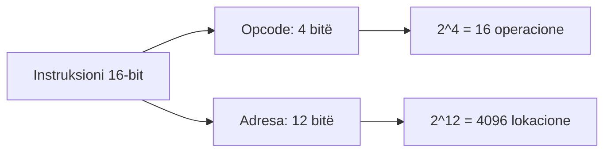
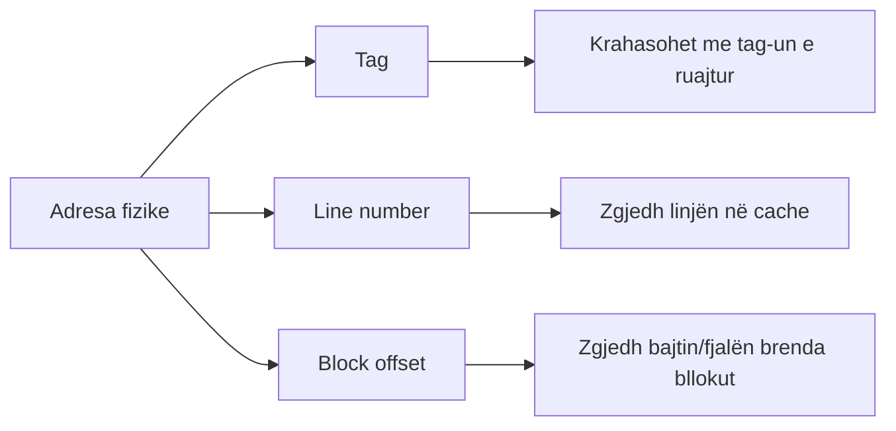
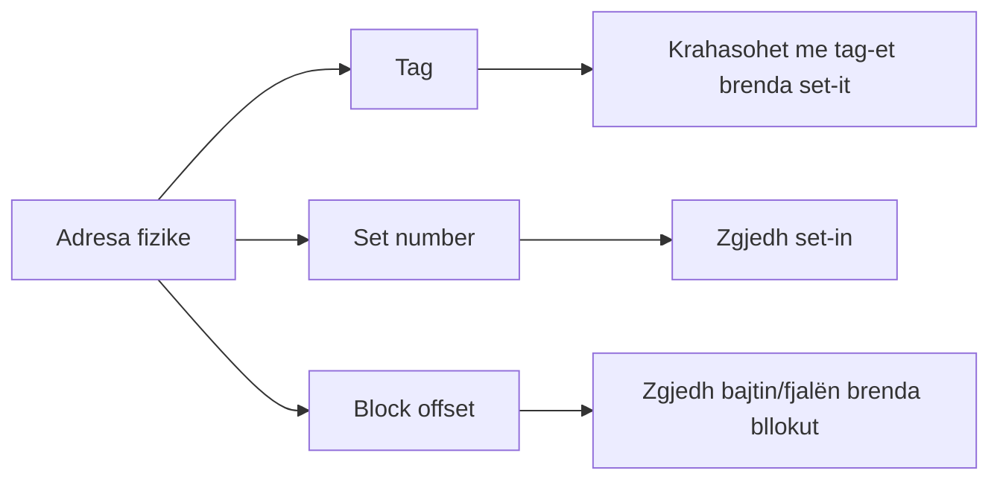
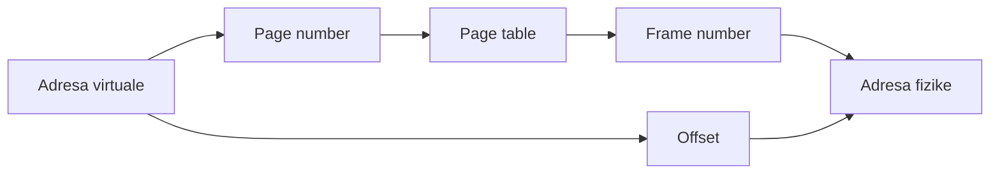
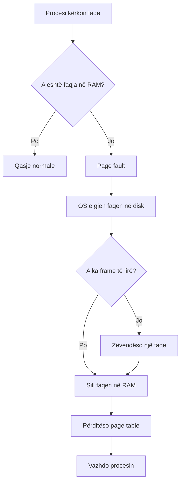

---
{"dg-publish":true,"permalink":"/semester-4/arkitekture/koll-2/formulas/","tags":["formulas","arkitekture-kompjuterike","koll2"]}
---


# Formula dhe ekuacione - Arkitekturë Kompjuterike Koll 2

Kjo është fletë e shpejtë për pjesën me detyra/formula. Ideja: mëso formën, pastaj zëvendëso numrat.

---

# 1. Njësitë bazë

## Fuqitë që dalin shpesh

| Vlera | Kuptimi |
|---|---|
| `2^10` | `1024 = 1 KB` |
| `2^20` | `1 MB` |
| `2^30` | `1 GB` |
| `2^32` | `4 GB` |

## Konvertime

```text
1 KB = 2^10 B
1 MB = 2^20 B
1 GB = 2^30 B
```

## Rregulli i artë

Nëse diçka është madhësi `2^n`, atëherë duhen `n` bitë për ta adresuar.

Shembuj:

```text
64 = 2^6       -> 6 bitë
256 = 2^8      -> 8 bitë
1 KB = 2^10    -> 10 bitë
4 KB = 2^12    -> 12 bitë
```

---

# 2. Adresimi i memories

## Formula kryesore

```text
2^A = N
```

Ku:

- `A` = numri i bitëve të adresës
- `N` = numri i njësive të adresueshme

Nëse memoria është byte-addressable, atëherë `N` është numri i bajtëve.

## Shembull 32-bit

```text
2^32 B = 4 GB
```

Pra, një sistem 32-bit me adresim në bajt mund të adresojë maksimalisht rreth `4 GB`.

## Si ta gjesh numrin e bitëve

```text
A = log2(N)
```

Shembull:

```text
N = 4096 = 2^12
A = 12 bitë
```

---

# 3. Performanca e memories

Këto janë formulat që ishin në slajdin e screenshot-it.

## Koha e ciklit memorues

```text
Memory cycle time = Access time + koha shtesë para qasjes tjetër
```

Për memoriet me qasje të rastit, shpejtësia e transmetimit jepet si:

```text
Transfer rate = 1 / memory cycle time
```

Nëse koha e ciklit është në sekonda, rezultati del në transferime për sekondë.

## Memorie jo me qasje të rastit

Për memorie që nuk janë me qasje të rastit:

```text
Tn = TA + n / R
```

Ku:

- `Tn` = koha mesatare për të lexuar ose shkruar `n` bitë
- `TA` = koha mesatare e qasjes
- `n` = numri i bitëve
- `R` = shpejtësia e transferit, në bitë për sekondë (`bps` ose `b/s`)

## Si ta përdorësh

Nëse jepen:

```text
TA = 5 ms
n = 4096 bitë
R = 2,000,000 b/s
```

Atëherë:

```text
Tn = 5 ms + 4096 / 2,000,000 s
Tn = 5 ms + 0.002048 s
Tn = 5 ms + 2.048 ms
Tn = 7.048 ms
```

Kujdes me njësitë: nëse `TA` është në ms, kthe edhe `n/R` në ms.

---

# 4. Basi i sistemit

Në slajde përmendet që performanca e bus-it varet nga gjerësia dhe frekuenca. Formula praktike:

```text
Transfer rate = bus width * frequency
```

Nëse `bus width` është në bitë dhe `frequency` në Hz:

```text
Transfer rate = bitë / sekondë
```

Nëse e do në bajt/s:

```text
Transfer rate in B/s = (bus width in bits * frequency) / 8
```

## Shembull

```text
Bus width = 64 bit
Frequency = 100 MHz = 100 * 10^6 Hz

Transfer rate = 64 * 100 * 10^6 bit/s
Transfer rate = 6.4 * 10^9 bit/s
Transfer rate = 800 * 10^6 B/s
Transfer rate = 800 MB/s
```

---

# 5. Formati i instruksionit

Në kompjuterin hipotetik:

```text
Instruksioni = opcode + address
```

Në kapitull:

```text
4 bitë opcode + 12 bitë adresë
```

## Numri i kodeve të operacioneve

```text
Numri i opcode-ve = 2^(bitët e opcode)
```

Shembull:

```text
2^4 = 16 kode operacionesh
```

## Numri i fjalëve që mund të adresohen

```text
Numri i fjalëve = 2^(bitët e adresës)
```

Shembull:

```text
2^12 = 4096 fjalë
```

## Diagram



---

# 6. Cache - formula kryesore

## Hit rate dhe miss rate

```text
miss rate = 1 - hit rate
```

ose:

```text
m = 1 - h
```

Shembull:

```text
h = 99% = 0.99
m = 1 - 0.99 = 0.01 = 1%
```

## EMAT

```text
EMAT = Tc + m * Tm
```

Ku:

- `EMAT` = Effective Memory Access Time
- `Tc` = koha e qasjes në cache
- `m` = miss rate
- `Tm` = miss penalty

## Shembull EMAT

```text
Tc = 10 ns
m = 0.01
Tm = 100 ns

EMAT = 10 + 0.01 * 100
EMAT = 10 + 1
EMAT = 11 ns
```

## Kur formula del pak më ndryshe

Nganjëherë mund të jepet:

```text
EMAT = h * Tc + m * (Tc + Tm)
```

Kjo thjeshtohet në:

```text
EMAT = Tc + m * Tm
```

sepse:

```text
h + m = 1
```

---

# 7. Madhësia e cache-it

## Numri i linjave në cache

```text
Numri i linjave = Madhësia e cache / Madhësia e linjës
```

ose:

```text
lines = cache size / block size
```

Shembull:

```text
Cache = 16 KB
Block = 256 B

16 KB = 16 * 1024 B = 16384 B
lines = 16384 / 256 = 64 linja
```

## Bitët për line number

```text
line bits = log2(numri i linjave)
```

Shembull:

```text
64 linja = 2^6
line bits = 6
```

## Bitët për block offset

```text
offset bits = log2(madhësia e bllokut në bajtë)
```

Shembull:

```text
Block = 256 B = 2^8
offset bits = 8
```

---

# 8. Notacioni i përgjithshëm i cache-it

Këto simbole dalin shpesh në detyra:

| Simboli | Kuptimi |
|---|---|
| `A` | numri total i bitëve të adresës fizike |
| `w` | bitët e offset-it brenda bllokut |
| `s` | bitët që identifikojnë bllokun në memorien kryesore |
| `r` | bitët për line number në cache direkt |
| `d` | bitët për set number në set-associative cache |
| `m` | numri total i linjave në cache |
| `k` | numri i linjave për set |
| `v` | numri i set-eve |

## Lidhja e adresës

```text
A = s + w
```

Ku:

- `A` = bitët e adresës fizike
- `s` = bitët e bllokut të memories kryesore
- `w` = bitët e fjalës/bajtit brenda bllokut

## Madhësia e bllokut

```text
Block size = 2^w
```

Nëse memoria është byte-addressable, madhësia del në bajtë.

## Numri i blloqeve në memorien kryesore

```text
Number of main memory blocks = 2^s
```

## Numri i linjave në cache direkt

```text
m = 2^r
```

## Madhësia e cache-it

```text
Cache size = number of lines * block size
Cache size = m * 2^w
```

Nëse `m = 2^r`:

```text
Cache size = 2^r * 2^w = 2^(r+w)
```

---

# 9. Pasqyrimi direkt në cache

## Formula

```text
i = j mod m
```

Ku:

- `i` = linja në cache
- `j` = numri i bllokut në memorien kryesore
- `m` = numri i linjave në cache

## Shembull

```text
j = 17
m = 6

i = 17 mod 6
i = 5
```

Pra blloku 17 shkon në linjën 5, nëse numërimi fillon nga 0.

## Struktura e adresës

```text
Tag | Line number | Block offset
```

## Si gjenden bitët

```text
offset bits = log2(block size)
line bits = log2(number of cache lines)
tag bits = address bits - line bits - offset bits
```

Me notacionin e slajdeve:

```text
Tag bits = s - r
Address = Tag(s-r) | Line(r) | Word/Offset(w)
```

Ku:

```text
m = 2^r
block size = 2^w
main memory blocks = 2^s
```

## Diagram



## Mini-shembull

Jepet:

```text
Address = 16 bitë
Cache = 16 KB
Block = 256 B
```

Zgjidhja:

```text
Block = 256 B = 2^8
offset bits = 8

Cache = 16 KB = 2^14 B
Lines = 2^14 / 2^8 = 2^6
line bits = 6

tag bits = 16 - 6 - 8 = 2
```

Pra:

```text
Tag = 2 bitë
Line = 6 bitë
Offset = 8 bitë
```

---

# 10. Pasqyrimi plotësisht asociativ

## Ideja

Te pasqyrimi plotësisht asociativ, blloku mund të vendoset në cilëndo linjë të cache-it.

## Struktura e adresës

```text
Tag | Block offset
```

## Si gjenden bitët

```text
offset bits = log2(block size)
tag bits = address bits - offset bits
```

Me notacionin e slajdeve:

```text
Address = Tag(s) | Word/Offset(w)
```

Nuk ka `line bits`, sepse blloku mund të vendoset në cilëndo linjë.

## Kujdes në provim

Nuk ka `line number`, sepse blloku mund të jetë në çdo linjë. Prandaj kërkohet krahasim i tag-ut me shumë linja.

---

# 11. Pasqyrimi set-asociativ

## Formula

```text
set = block number mod number of sets
```

## Struktura e adresës

```text
Tag | Set number | Block offset
```

## Numri i set-eve

```text
number of sets = number of cache lines / k
```

Ku:

- `k` = numri i linjave në secilin set

P.sh. `4-way set associative` do të thotë:

```text
k = 4 linja për set
```

Me notacion:

```text
m = k * v
v = 2^d
m = k * 2^d
```

Ku:

- `m` = numri total i linjave në cache
- `k` = linjat për set
- `v` = numri i set-eve
- `d` = bitët për set number

## Si gjenden bitët

```text
offset bits = log2(block size)
set bits = log2(number of sets)
tag bits = address bits - set bits - offset bits
```

Me notacionin e slajdeve:

```text
Address = Tag(s-d) | Set(d) | Word/Offset(w)
```

Madhësia e cache-it:

```text
Cache size = k * 2^d * 2^w
Cache size = k * 2^(d+w)
```

## Diagram



## Mini-shembull

Jepet:

```text
Cache = 512 KB
Block = 1 KB
8-way set associative
Address = 23 bitë
```

Zgjidhja:

```text
Cache lines = 512 KB / 1 KB = 512 linja = 2^9

k = 8 = 2^3
sets = 512 / 8 = 64 sete = 2^6

offset bits = log2(1 KB) = 10
set bits = log2(64) = 6
tag bits = 23 - 6 - 10 = 7
```

Pra:

```text
Tag = 7 bitë
Set = 6 bitë
Offset = 10 bitë
```

---

# 12. Madhësia e tag directory

Në detyra mund të kërkohet madhësia e direktoriumit të tag-eve.

## Formula bazë

```text
Tag directory size = number of cache lines * tag bits
```

Nëse kërkohet në bajtë:

```text
Tag directory size in bytes = (number of cache lines * tag bits) / 8
```

## Kujdes

Në detyra reale mund të shtohen edhe:

- valid bit
- dirty bit
- replacement bits

Nëse detyra nuk i përmend, zakonisht llogarit vetëm tag bits.

---

# 13. Write policies

Këtu zakonisht nuk ka llogaritje, por janë definicione që dalin shpesh.

## Write-through

```text
Shkruaj në cache + shkruaj menjëherë në memorien kryesore
```

Përparësi:

```text
Memoria kryesore është gjithmonë e përditësuar
```

Mangësi:

```text
Më shumë trafik në bus
```

## Write-back

```text
Shkruaj vetëm në cache
Përditëso memorien kryesore kur blloku largohet
```

Përparësi:

```text
Më pak trafik në bus
```

Mangësi:

```text
Më kompleks, kërkon dirty bit
```

---

# 14. DRAM, SRAM, ROM - krahasime të shpejta

Këto janë më shumë tabela sesa formula, por janë high-yield.

## DRAM vs SRAM

| Tipari | DRAM | SRAM |
|---|---|---|
| Ruajtja | Kondensator | Latch/flip-flop |
| Refresh | Po | Jo |
| Shpejtësia | Më e ngadalshme | Më e shpejtë |
| Densiteti | Më i lartë | Më i ulët |
| Kosto për bit | Më e ulët | Më e lartë |
| Përdorimi | Memorie kryesore | Cache |

## ROM family

| Lloji | Formula mendore |
|---|---|
| ROM | Shkruhet gjatë fabrikimit |
| PROM | Programohet një herë |
| EPROM | Fshihet me UV, riprogramohet |
| EEPROM | Fshihet/shkruhet elektrikisht |
| Flash | EEPROM-like, por fshin në blloqe |

---

# 15. Organizimi i çipit të memories

## Numri i linjave të adresës

Nëse duhet zgjedhur një nga `W` fjalët/rreshtat:

```text
address lines = log2(W)
```

Shembull:

```text
W = 2048 = 2^11
address lines = log2(2048) = 11
```

## Organizimi W x B

Nëse çipi është organizuar si:

```text
W words x B bits
```

atëherë kapaciteti total është:

```text
Total capacity = W * B bits
```

## Shembull DRAM 16 Mbit

Në slajde del organizimi:

```text
4M x 4
```

Kjo do të thotë:

```text
4M words * 4 bits = 16 Mbits
```

Nëse `4M = 2^22` fjalë:

```text
address bits = 22
```

Në DRAM adresat shpesh multipleksohen:

```text
22 address bits = 11 row bits + 11 column bits
```

Kjo zvogëlon numrin e pinave të adresës.

## Shembull EPROM 1M x 8

```text
1M = 2^20 words
address lines = 20
data lines = 8
capacity = 1M * 8 = 8 Mbits
```

---

# 16. Error detection / Hamming

## Fjalë e ruajtur me kod kontrolli

```text
Total stored bits = M + K
```

Ku:

- `M` = bitët e të dhënave
- `K` = bitët kontrollues

## Rregulli për numrin e bitëve kontrollues në Hamming

```text
2^K >= M + K + 1
```

Forma ekuivalente nga slajdet:

```text
2^K - 1 >= M + K
```

Ku:

- `M` = numri i bitëve të të dhënave
- `K` = numri i bitëve të kontrollit

## Shembull

Për `M = 8`:

```text
K = 3:
2^3 >= 8 + 3 + 1
8 >= 12   gabim

K = 4:
2^4 >= 8 + 4 + 1
16 >= 13  saktë
```

Pra duhen:

```text
K = 4 bitë kontrolli
```

## Sindroma

```text
Sindroma = 0  -> nuk ka gabim
Sindroma ≠ 0  -> tregon pozicionin e gabimit
```

Rangu i sindromës:

```text
0 deri në 2^K - 1
```

Në versionin bazik:

```text
Hamming korrigjon gabim me 1 bit
```

---

# 17. Disku magnetik

## Access time

```text
Access time = Seek time + Rotational latency
```

Ku:

- `Seek time` = koha për lëvizjen e kokës në trasenë e duhur
- `Rotational latency` = pritja derisa sektori i duhur vjen nën kokë

## Koha totale e I/O

```text
Total I/O time = Seek time + Rotational latency + Transfer time + Controller overhead
```

Nëse nuk jepet controller overhead:

```text
Total I/O time ≈ Seek time + Rotational latency + Transfer time
```

## Rotational latency mesatare

Nëse jepet RPM:

```text
RPS = RPM / 60
Time per rotation = 1 / RPS
Average rotational latency = Time per rotation / 2
```

E njëjta formulë me `r`:

```text
r = rotations per second = RPM / 60
Average rotational latency = 1 / (2r)
```

## Transfer time te disku

Nëse jepen:

- `b` = numri i bajtëve që transferohen
- `N` = numri i bajtëve në një trase
- `r` = rrotullime për sekondë

atëherë:

```text
Transfer time = b / (r * N)
```

## Koha totale e qasjes në disk

Forma më e plotë:

```text
Tdisk = Ts + 1/(2r) + b/(rN)
```

Ku:

- `Ts` = seek time mesatar
- `1/(2r)` = rotational latency mesatare
- `b/(rN)` = transfer time

Nëse detyra jep veç `rotational latency`, përdor:

```text
Tdisk = seek time + rotational latency + transfer time
```

## Shembull

Jepet:

```text
Disk = 7200 RPM
```

Zgjidhja:

```text
RPS = 7200 / 60 = 120 rotations/s
Time per rotation = 1 / 120 = 0.00833 s = 8.33 ms
Average rotational latency = 8.33 / 2 = 4.17 ms
```

## Diagram


---

# 18. RAID - ide për provim

RAID zakonisht del si koncept, jo si llogaritje e gjatë.

## RAID

```text
RAID = disa disqe që duken si një sistem logjik
```

Qëllimet:

```text
Performancë më e mirë
Besueshmëri më e mirë
Ose të dyja
```

## Termat

| Termi | Kuptimi |
|---|---|
| Striping | Të dhënat ndahen në disa disqe |
| Mirroring | Të dhënat kopjohen në më shumë se një disk |
| Parity | Informacion shtesë për rikonstruktim pas dështimit |

---

# 19. Memoria virtuale

## Ndarja e adresës virtuale

```text
Virtual address = Page number | Offset
```

## Ndarja e adresës fizike

```text
Physical address = Frame number | Offset
```

## Rregulli kryesor

```text
Offset-i mbetet i njëjtë
Page number përkthehet në frame number
```

## Diagram



## Numri i faqeve virtuale

```text
Number of virtual pages = Virtual address space / Page size
```

Në fuqi të 2-shit:

```text
virtual pages = 2^(virtual address bits - offset bits)
```

## Numri i page frames

```text
Number of page frames = Physical memory size / Page size
```

Në fuqi të 2-shit:

```text
page frames = 2^(physical address bits - offset bits)
```

## Bitët për offset

```text
offset bits = log2(page size)
```

## Bitët për page number

```text
page number bits = virtual address bits - offset bits
```

ose:

```text
page number bits = log2(number of virtual pages)
```

## Bitët për frame number

```text
frame number bits = physical address bits - offset bits
```

ose:

```text
frame number bits = log2(number of page frames)
```

---

# 20. Shembull virtual memory 1

Jepet:

```text
Virtual address space = 8 KB
Physical memory = 4 KB
Page size = 1 KB
```

## Numri i faqeve virtuale

```text
8 KB / 1 KB = 8 faqe = 2^3
```

Pra:

```text
page number bits = 3
```

## Offset

```text
1 KB = 2^10
offset bits = 10
```

## Adresa virtuale

```text
Virtual address = 3 bitë page number + 10 bitë offset
Virtual address = 13 bitë
```

## Numri i page frames

```text
4 KB / 1 KB = 4 frames = 2^2
```

Pra:

```text
frame number bits = 2
```

## Adresa fizike

```text
Physical address = 2 bitë frame number + 10 bitë offset
Physical address = 12 bitë
```

---

# 21. Shembull virtual memory 2

Jepet:

```text
Virtual address space = 64 GB
Page size = 8 KB
```

## Numri i faqeve virtuale

```text
64 GB = 64 * 2^30 = 2^6 * 2^30 = 2^36 B
8 KB = 8 * 2^10 = 2^3 * 2^10 = 2^13 B

Number of pages = 2^36 / 2^13 = 2^23
```

Pra:

```text
2^23 faqe virtuale
```

---

# 22. Page fault

Nuk është formulë, por del si proces.

## Rrjedha

```text
1. Procesi kërkon faqe
2. Faqja nuk është në RAM
3. Ndodh page fault
4. OS gjen faqen në disk
5. Nëse RAM është plot, largohet një faqe tjetër
6. Faqja sillet në RAM
7. Page table përditësohet
8. Procesi vazhdon
```

## Diagram



---

# 23. Mini cheatsheet final

## Cache

```text
m = 1 - h
EMAT = Tc + m * Tm
lines = cache size / block size
offset bits = log2(block size)
direct line = block number mod number of lines
set = block number mod number of sets
Cache size = lines * block size
Cache size = m * 2^w
```

## Direct mapping

```text
Tag | Line | Offset
tag bits = address bits - line bits - offset bits
Tag bits = s - r
i = j mod m
```

## Associative mapping

```text
Tag | Offset
tag bits = address bits - offset bits
Address = Tag(s) | Offset(w)
```

## Set-associative mapping

```text
Tag | Set | Offset
sets = lines / k
tag bits = address bits - set bits - offset bits
m = k * v
v = 2^d
Cache size = k * 2^(d+w)
```

## Disk

```text
Access time = Seek time + Rotational latency
Average rotational latency = (1 / (RPM / 60)) / 2
Average rotational latency = 1 / (2r)
Transfer time = b / (rN)
Tdisk = Ts + 1/(2r) + b/(rN)
```

## Virtual memory

```text
Virtual address = Page number | Offset
Physical address = Frame number | Offset
pages = virtual address space / page size
frames = physical memory / page size
offset bits = log2(page size)
```

## Hamming

```text
2^K >= M + K + 1
2^K - 1 >= M + K
Total stored bits = M + K
```

## Memorie jo me qasje të rastit

```text
Tn = TA + n / R
```

## Basi

```text
Transfer rate = bus width * frequency
Transfer rate in B/s = (bus width in bits * frequency) / 8
```

## Çip memorik

```text
address lines = log2(W)
Total capacity = W * B bits
```
