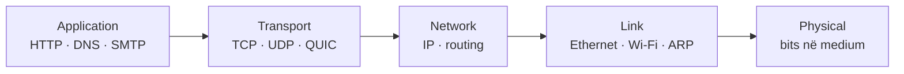

---
{"dg-publish":true,"permalink":"/semester-4/rrjeta/chat-gpt/","tags":["university/rrjeta","exam-study"]}
---

# Rrjetat kompjuterike — udhëzues për provim

> [!abstract] Çfarë mbulon ky dokument
> Përmbledhje e shtatë ligjëratave: nga Interneti dhe HTTP, te TCP/IP, routing, Ethernet, Wi‑Fi dhe 4G/5G. Përdore së bashku me [[Semester 4/Rrjeta/Flashcards\|Semester 4/Rrjeta/Flashcards]]: lexo një kapitull, pastaj testoje veten me kartat përkatëse.

## Si të studiosh shpejt

1. Fikso fillimisht **ndarjen në shtresa** dhe njësitë e të dhënave: `message → segment → datagram → frame → bits`.
2. Për çdo protokoll, dije: **qëllimin, shtresën, transportin/portin, gjendjen që ruan dhe kufizimin kryesor**.
3. Për pyetjet me rrjedhë, trego hapat me radhë: DHCP, DNS, HTTP/TCP, ARP, routing, frame Ethernet.
4. Mos i ngatërro çiftet klasike: TCP/UDP, routing/forwarding, IP/MAC, circuit/packet switching, link-state/distance-vector, CSMA/CD/CSMA/CA.

## Harta e madhe

| Shtresa | Puna kryesore | PDU | Shembuj |
|---|---|---|---|
| Application | Shërbimi për programin | message | HTTP, DNS, SMTP, DASH |
| Transport | Proces‑më‑proces | segment | TCP, UDP, QUIC |
| Network | Host‑më‑host, rrugë | datagram | IP, ICMP, routing |
| Link | Nyje fqinje në një lidhje | frame | Ethernet, 802.11, ARP |
| Physical | Dërgon bitet në medium | bits | fibër, bakër, radio |

**Encapsulation:** dërguesi shton header në çdo shtresë; marrësi i heq në rend të kundërt. Routeri zakonisht kontrollon IP dhe ndërton frame të ri për hop-in tjetër; MAC-të ndryshojnë hop‑pas‑hop, IP source/destination zakonisht mbeten fund‑më‑fund.

## Fletë formulash dhe fakte që bien në provim

- **Transmission delay:** $d_{trans}=L/R$; `L` = gjatësi pakete (bits), `R` = rate i linkut (bps).
- **Nodal delay:** $d_{nodal}=d_{proc}+d_{queue}+d_{trans}+d_{prop}$.
- **Propagation delay:** $d_{prop}=d/s$; `d` = distanca, `s` = shpejtësia e propagimit. Mos e ngatërro me transmission delay.
- **Traffic intensity:** $\rho=La/R$. Kur $\rho\to1$, queueing delay rritet fort; kur $\rho>1$, sistemi është i paqëndrueshëm mesatarisht.
- **Throughput end‑to‑end:** kufizohet nga **bottleneck link**: $\min(R_1,R_2,\ldots)$.
- **TCP throughput i thjeshtuar:** rreth $3W/(4\,RTT)$ kur dritarja luhatet nga $W/2$ në $W$.
- **Checksum:** zbulon disa gabime; **CRC** ka aftësi shumë më të fortë zbulimi për burst errors. Asnjëra nuk garanton siguri kundër sulmuesit.

> [!warning] Rregulli i artë
> **Address IP** përdoret nga network layer për destinacionin fundor/routing. **MAC address** përdoret vetëm lokalisht që një frame të arrijë interface-in fqinj në të njëjtin LAN. ARP i lidh ato dy adresa në subnet.

# 1. Bazat e Internetit

## Interneti, protokollet dhe edge/core

- Interneti është një **network of networks**: end systems (hosts), access networks, routers/switches dhe ISP të ndërlidhur.
- Një **protokoll** përcakton formatin/rendin e mesazheve dhe veprimet kur dërgohen ose pranohen. Protokollet ekzistojnë në çdo shtresë.
- **Network edge:** client dhe server; **access network:** lidhja e hostit me routerin e parë; **network core:** mesh routerësh që dërgon paketa mes rrjeteve.
- Mediumet janë guided (twisted pair, coax, fibër) ose unguided (radio). Fibra ka kapacitet të madh dhe imunitet të mirë ndaj interferencës.

## Packet switching kundrejt circuit switching

| Packet switching | Circuit switching |
|---|---|
| Mesazhi ndahet në paketa, burimet ndahen sipas kërkesës | Burimet rezervohen end‑to‑end për call |
| Efikas për trafik bursty; ka queueing/loss | Performancë e parashikueshme; kapacitet bosh kur përdoruesi s’ka të dhëna |
| Store-and-forward: routeri e pranon paketin të plotë para se ta dërgojë | FDM/TDM ndajnë bandën/frekuencën ose kohën në circuits |

**Forwarding** = veprimi lokal input port → output port. **Routing** = llogaritja globale e rrugëve që mbush forwarding table.

## Performanca dhe siguria

- Buffer-i i routerit krijon **queueing** kur arrival rate tejkalon përkohësisht output rate; kur buffer-i mbushet, paketa bëhet **lost/dropped**.
- `traceroute` mat hop-et dhe RTT-të; throughput nuk është e njëjta gjë me bandwidth-in e një linku të vetëm.
- Sulmet bazë: **sniffing** (lexim i trafikut në medium shared), **IP spoofing** (source i falsifikuar) dhe **DoS** (shterim serveri/bandwidth-i). Mbrojtjet përfshijnë authentication, encryption dhe filtering.

## Shtresat dhe OSI

Internet stack ka 5 shtresa. OSI shton presentation (p.sh. compression/encryption/format) dhe session. Shtresimi ndan kompleksitetin në module me shërbime të qarta; kostoja është që ndonjë funksion mund të përsëritet në më shumë se një shtresë.

# 2. Application layer

## Arkitektura, proceset dhe sockets

- **Client-server:** serveri është zakonisht always-on, me adresë të qëndrueshme; klientët e kontaktojnë. E lehtë për kontroll, por serveri mund të bëhet bottleneck.
- **P2P:** peers janë njëkohësisht klientë dhe serverë; peer i ri sjell edhe upload capacity (**self-scalability**), por menaxhimi/churn janë më të vështira.
- Proceset në hoste të ndryshme komunikojnë përmes **sockets**. Socket identifikohet praktikisht nga IP + port; aplikacioni zgjedh protokollin e transportit.
- Aplikacioni kërkon nga transporti kombinim të reliability, throughput, latency dhe security. Audio/video interactive zakonisht toleron pak loss, por jo latency/jitter të madh.

## HTTP dhe Web

- HTTP është application protocol i Web-it, client/server dhe zakonisht **stateless**. Një web page ka base HTML object plus objektet e referuara.
- **Non-persistent HTTP:** zakonisht një TCP connection për objekt; koha për një objekt përafërsisht `2 RTT + transmission time`. **Persistent HTTP:** ripërdor connection-in dhe ul overhead/latency.
- Request ka method, URL, version, headers dhe opsionalisht body. Metoda të zakonshme: GET, POST, HEAD, PUT. Përgjigjja përmban status line, headers, body; p.sh. `200 OK`, `301`, `400`, `404`, `500`.
- **Cookies** ruajnë state përmes: `Set-Cookie`, `Cookie` në request, cookie file në browser dhe database në server. Janë të dobishme për session/shopping cart, por kanë implikime privacy.
- **Cache/proxy** shërben objektet afër klientit. Conditional GET me `If-Modified-Since` shmang dërgimin e objektit të pandryshuar (`304 Not Modified`).
- HTTP/2 multiplexon streams, por humbja në një TCP connection mund të shkaktojë HOL blocking. **HTTP/3** përdor QUIC mbi UDP, me encryption dhe streams të pavarura.

## E-mail dhe DNS

- **SMTP** transferon e-mail midis mail servers (TCP, port 25): handshake, transfer, close. Është push protocol.
- User agent lexon mailbox-in me **IMAP** (ruan/mund të sinkronizojë mailbox në server); POP3 është më i thjeshtë, zakonisht download-oriented.
- **DNS** është database e shpërndarë dhe hierarkike që përkthen name ↔ IP dhe mban records si A/AAAA, NS, CNAME, MX.
- Resolution zakonisht kalon local resolver → root → TLD → authoritative server. **Iterative:** serveri jep referral; **recursive:** serveri i kontaktuar e kryen kërkimin. Caching ul latency dhe trafik.

## P2P, video dhe CDN

- BitTorrent e ndan file-in në chunks; peer-i merr listën nga tracker dhe shkarkon/uploadon te neighbours. Tit-for-tat favorizon peers që kontribuojnë upload.
- Video përdor compression spatial dhe temporal. Client-side **playout buffer** absorbon network delay/jitter.
- **DASH**: video e koduar në nivele rate; client zgjedh segmentin/rate-in e përshtatshëm. **CDN** ruan kopje në nodes pranë përdoruesve për shkallëzim dhe latency më të ulët.

# 3. Transport layer

## Multiplexing, UDP dhe reliable data transfer

- Transport layer ofron logical communication **process-to-process**; network layer është **host-to-host**.
- **Multiplexing:** dërguesi mbledh data nga shumë sockets dhe shton header. **Demultiplexing:** marrësi përdor port-et (UDP) ose 4-tuple (TCP) për segmentin te socket-i i duhur.
- UDP është connectionless, best-effort, me header të vogël dhe pa reliability, flow control ose congestion control. Përdoret kur aplikacioni do latency të ulët ose menaxhon vetë humbjet.
- Reliable data transfer ndërtohet gradualisht me: checksum → ACK/NAK → sequence number për duplicate → timeout/retransmission për loss.

## Pipelining, GBN dhe SR

| Stop-and-wait | Go-Back-N (GBN) | Selective Repeat (SR) |
|---|---|---|
| Vetëm një paketë në fluturim | Sender ka window; ACK cumulative | Sender/receiver mbajnë windows |
| Utilizim i dobët kur RTT është i madh | Receiver zakonisht hedh out-of-order; timeout ri-dërgon nga paketa e humbur e tutje | Buffer-on out-of-order dhe ri-dërgon vetëm paketën e humbur |
| I thjeshtë | Më pak receiver state | Më efikas, por më kompleks; window duhet të kufizohet për të shmangur ambiguity |

## TCP: reliable byte stream

- TCP është connection-oriented, full-duplex, reliable/in-order byte stream dhe ka flow + congestion control. Socket TCP identifikohet nga `(source IP, source port, dest IP, dest port)`.
- **Sequence number** numëron byte-n e parë të segmentit; **ACK number** tregon byte-n e ardhshëm që marrësi pret (ACK cumulative).
- Timeout bazohet në `EstimatedRTT` dhe `DevRTT`; timeout shumë i shkurtër krijon retransmissions të panevojshme, shumë i gjatë e vonon recovery.
- Në timeout TCP ri-dërgon segmentin më të vjetër pa ACK. **Fast retransmit:** 3 duplicate ACK sugjerojnë një segment të humbur dhe nxisin retransmission para timeout-it.
- **Flow control:** `rwnd` reklamuar nga marrësi kufizon sa bytes mund të jenë in flight që receiver buffer të mos mbushet.
- **3-way handshake:** client SYN(seq=x) → server SYN+ACK(seq=y, ack=x+1) → client ACK(ack=y+1). Krijon state dhe shmang probleme nga segmente të vjetra/duplikate.

## Congestion control

- **Congestion** është mbingarkesë e rrjetit/router buffers, jo ngadalësi e aplikacionit apo receiver-it. Loss/delay janë sinjale tipike.
- TCP përdor `cwnd`; dritarja efektive është `min(cwnd, rwnd)`. ACK-të e mira rrisin rate-in, loss e ul.
- **Slow start:** `cwnd` rritet afërsisht eksponencialisht deri në `ssthresh`. **Congestion avoidance:** rritje additive rreth 1 MSS/RTT. Me triple duplicate ACK, TCP Reno e ul përgjysmë; me timeout rikthehet më agresivisht (zakonisht 1 MSS).
- **AIMD** (additive increase, multiplicative decrease) synon stabilitet dhe fairness mes TCP flows që ndajnë bottleneck-un.
- QUIC e vendos reliability/congestion control në user space mbi UDP dhe lejon streams pa TCP head-of-line blocking.

# 4. Network layer — data plane

## Routeri, forwarding dhe scheduling

- **Data plane** vendos lokalish çfarë i bëhet paketit; **control plane** përcakton forwarding tables. Input port kryen termination, lookup dhe forwarding; switching fabric e çon paketën në output port.
- Lookup tradicional përdor **longest prefix match**: prefiksi më specifik që përputhet me destination IP fiton.
- Switching fabric mund të jetë memory, bus ose interconnection network. Input/output queueing ndodh kur fabric/linku s’e përballon ritmin.
- Scheduling: FIFO është i thjeshtë; priority mund të vonojë klasat e ulëta; round robin qarkullon klasat; WFQ jep ndarje të peshuar/fair për flows.

## IPv4, subnet, DHCP, NAT, IPv6

- IPv4 address ka 32 bits dhe i përket një **interface-i**. Subnet-i përcaktohet me prefix/maskë, p.sh. `192.168.1.0/24`; 24 bits janë network part.
- DHCP ndan dinamikisht IP, subnet mask, default gateway dhe DNS. Rrjedha tipike: Discover → Offer → Request → ACK; klienti mund të rinovojë lease-in.
- NAT përkthen adresat/portet private në public address; ndihmon mungesën e IPv4 dhe izolimin lokal, por prish end-to-end transparency dhe e vështirëson inbound connections.
- IPv6 ka 128-bit addresses, header më të thjeshtuar dhe pa fragmentation nga routers. Për bashkëjetesë me IPv4 përdoren dual stack dhe tunneling.

## Generalized forwarding dhe arkitektura

- Në **match+action**, flow table bën match mbi fusha header dhe kryen forward/drop/modify/send-to-controller. Është më i përgjithshëm se routing vetëm sipas destination IP.
- I njëjti abstraksion shpjegon router, switch, firewall dhe NAT. Interneti ka “thin waist”: IP në mes, shumë aplikacione sipër dhe shumë link technologies poshtë.
- **End-to-end argument:** një funksion që kërkon njohuri të plotë të aplikacionit shpesh duhet të jetë në endpoints; rrjeti mund të ndihmojë, por s’e zëvendëson korrektësinë end-to-end.

# 5. Network layer — control plane

## Routing algorithms dhe OSPF

- Qëllimi i routing: rrugë “të mira” sipas cost, delay, congestion ose policy. Një path është sekuencë routerësh.
- **Link-state (LS):** çdo router ka topologjinë/koston e plotë (flooding) dhe përdor Dijkstra. Set-i `N'` rritet me nyjën jashtë tij që ka cost minimal; update: $D(b)=\min(D(b),D(a)+c_{a,b})$.
- **Distance-vector (DV):** çdo router mban cost për destinacione dhe shkëmben vector-in me neighbours; Bellman-Ford: $D_x(y)=\min_v\{c(x,v)+D_v(y)\}$. Problemi klasik është **count-to-infinity** kur “bad news travels slow”; poisoned reverse ndihmon, nuk e zgjidh çdo loop.
- **OSPF** është intra-AS link-state: flooding, Dijkstra, areas për scale dhe authentication. Intra-AS optimizon policy/performance nën një administrator.

## BGP, SDN dhe management

- Interneti ndahet në **Autonomous Systems (AS)**. **BGP** është inter-AS path-vector mbi TCP; e reklamojnë reachable prefixes dhe AS-PATH.
- eBGP shkëmben routes mes AS-ve, iBGP i shpërndan brenda AS-it. Zgjedhja e BGP bazohet shumë në **policy**, jo vetëm shortest path; AS mund të mos reklamojë rrugë nga të cilat s’përfiton.
- **SDN:** control plane është logjikisht i centralizuar në controller; switches zbatojnë data plane flow rules. Controller ofron API për apps si routing, firewall, load balancing dhe traffic engineering; OpenFlow është shembull southbound protocol.
- **ICMP** bart error/reporting (p.sh. destination unreachable, TTL expired) dhe përdoret nga ping/traceroute.
- Network management: SNMP manager ↔ agent, MIB me objects; `Get`, `GetNext`, `GetBulk`, `Set`, `Response`, `Trap`. NETCONF përdor RPC për configuration; **YANG** përshkruan strukturën/constraints e data model.

# 6. Link layer dhe LANs

## Error detection dhe multiple access

- Link layer dërgon datagram-in në një link, host↔router ose router↔router. Implementohet në NIC me hardware/firmware/software.
- Parity zbulon gabime të thjeshta; 2D parity mund të korrigjojë single-bit error; checksum përdor one’s-complement; **CRC** llogarit remainder modulo-2 me generator `G` dhe zbulon shumë burst errors.
- MAC protocols: **channel partitioning** (TDM/FDM/CDMA), **random access** (ALOHA/CSMA) dhe **taking turns** (polling/token).
- Slotted ALOHA dërgon vetëm në slot boundaries; collision → random retransmission. CSMA “listens before transmit”; Ethernet **CSMA/CD** zbulon collision dhe aborton. Wi‑Fi nuk mund të bëjë collision detection me besueshmëri, prandaj përdor CSMA/CA.

## Ethernet, MAC, ARP dhe switches

- MAC është 48-bit link-layer address. Broadcast Ethernet është `FF:FF:FF:FF:FF:FF`; MAC është lokal dhe jo routing address.
- **ARP:** nëse host-i s’e di MAC-in për një IP lokale, broadcast-on ARP request; pronari i IP-së përgjigjet unicast dhe entry ruhet me TTL. Për subnet tjetër, ARP kërkon MAC-in e default gateway, jo MAC-in e hostit larg.
- Ethernet frame: preamble, destination MAC, source MAC, type, payload, CRC. Switch-i self-learns `(source MAC, incoming interface, timestamp)`; destinacion i panjohur flood-ohet, i njohur forward-ohet vetëm në portin e duhur.
- Routeri ndan broadcast domains; switch-i zakonisht jo. Routeri kontrollon IP, switch-i MAC.

## VLAN, MPLS dhe datacenter

- VLAN krijon LAN-e logjike mbi infrastrukturë fizike: zvogëlon broadcast domain dhe lehtëson administrimin. 802.1Q tag lejon trunk links të mbajnë frame nga shumë VLAN-e.
- MPLS vendos label dhe lejon forwarding/path bazuar në label, jo vetëm destination IP; i dobishëm për traffic engineering dhe policy.
- Datacenter networks përdorin ToR switches, topologji të pasura me multi-path dhe linke me kapacitet të lartë për throughput/redundancy.

# 7. Wireless dhe mobile networks

## Wireless links dhe 802.11

- Wireless ≠ domosdoshmërisht mobile. Elemente: host wireless, base station/AP, wireless link dhe wired infrastructure.
- Karakteristikat: attenuation/path loss, interference, multipath fading dhe **hidden terminal**. SNR i lartë zakonisht jep BER më të ulët; rate adaptation ul/rrit modulation sipas channel-it.
- 802.11 association: client skanon beacons (SSID/MAC), zgjedh AP, autentikohet dhe zakonisht merr IP me DHCP.
- **CSMA/CA:** nëse kanali është idle pas DIFS, dërgon; nëse busy, zgjedh random backoff. Receiver dërgon ACK pas SIFS. RTS/CTS mund të rezervojë mediumin e të reduktojë hidden-terminal collision.
- Wi‑Fi frame mund të ketë deri në katër adresa për skenarë AP/distribution system. Power management: client njofton sleep, AP buffer-on frames dhe beacons e njoftojnë klientin.

## Bluetooth, 4G/5G dhe mobility

- Bluetooth është personal-area wireless dhe përdor frequency hopping për rezistencë ndaj interferencës.
- LTE/4G: UE lidhet te eNodeB; data path kalon S-GW dhe P-GW; control plane përfshin MME dhe HSS. OFDMA ndan subcarriers/time resource blocks mes UE-ve. Tunnels GTP bartin datagramet në core.
- 5G e zhvendos shumë funksione drejt cloud/edge, përdor architecture më modular/SDN-like dhe synon eMBB, mMTC, URLLC sipas nevojës së shërbimit.
- Mobility kërkon association, authentication, location tracking dhe **handover**. Në indirect routing, home network mban location dhe tunelon datagramet te visited network; thjeshton correspondent-in por mund të krijojë triangle routing.
- Në wireless, loss mund të vijë nga bit errors ose handover, jo congestion; TCP mund ta keqinterpretojë loss-in dhe të ulë `cwnd`.

## Pyetje kontrolli para provimit

- A mund të shpjegosh me një fjali dallimin e çdo çifti në tabelën e mëposhtme?

| Mos i ngatërro | Dallimi kyç |
|---|---|
| forwarding / routing | veprim lokal / llogaritje rrugësh |
| UDP / TCP | best-effort pa connection / reliable byte stream me state |
| flow control / congestion control | mbron receiver-in / mbron rrjetin |
| IP / MAC | end-to-end logical / local link-layer |
| ARP / DNS | IP→MAC në LAN / name→IP në Internet |
| OSPF / BGP | intra-AS link-state / inter-AS policy path-vector |
| CSMA/CD / CSMA/CA | detect collision Ethernet / avoid collision Wi‑Fi |
| NAT / firewall | address/port translation / permit-deny policy |

> [!success] Strategjia e përgjigjes
> Për një “shpjego procesin” fillo me shtresën dhe PDU-në, rendit mesazhet/hapat, pastaj thuaj çfarë state ruhet dhe çfarë ndodh kur ka loss/error. Kjo strukturë fiton pikë edhe kur detajet e një header-i harrohen.

## Burimi i përmbledhjes

Përgatitur nga `Ligjerata 1.pptx` deri te `Ligjerata 7.pptx` në `E:\Other\University\Rrjetat kompjuterike\Ligjeratat` (805 slides gjithsej). Nuk është zëvendësim për detyrat numerike dhe diagramet specifike të profesorit; për ato, përdor slide-t përkatëse pasi të kesh fiksuar konceptet këtu.
