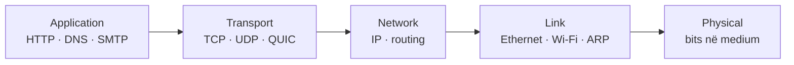

---
{"dg-publish":true,"permalink":"/semester-4/rrjeta/chat-gpt/","tags":["university/rrjeta","exam-study"]}
---

# Rrjetat kompjuterike — udhëzues për provim

> [!abstract] Çfarë mbulon ky dokument
> Shënime të detajuara nga shtatë ligjëratat: nga Interneti dhe HTTP, te TCP/IP, routing, Ethernet, Wi‑Fi dhe 4G/5G. Seksionet e para janë për rikujtim të shpejtë; pjesa **Shënime të zgjeruara** është materiali kryesor për studim. Përdore së bashku me [[Semester 4/Rrjeta/Flashcards\|Semester 4/Rrjeta/Flashcards]] për vetëtestim.

## Si të studiosh shpejt

1. Fikso fillimisht **ndarjen në shtresa** dhe njësitë e të dhënave: `message → segment → datagram → frame → bits`.
2. Për çdo protokoll, dije: **qëllimin, shtresën, transportin/portin, gjendjen që ruan dhe kufizimin kryesor**.
3. Për pyetjet me rrjedhë, trego hapat me radhë: DHCP, DNS, HTTP/TCP, ARP, routing, frame Ethernet.
4. Mos i ngatërro çiftet klasike: TCP/UDP, routing/forwarding, IP/MAC, circuit/packet switching, link-state/distance-vector, CSMA/CD/CSMA/CA.

## Harta e madhe



| Shtresa | Puna kryesore | PDU | Shembuj |
|---|---|---|---|
| Application | Shërbimi për programin | message | HTTP, DNS, SMTP, DASH |
| Transport | Proces‑më‑proces | segment | TCP, UDP, QUIC |
| Network | Host‑më‑host, rrugë | datagram | IP, ICMP, routing |
| Link | Nyje fqinje në një lidhje | frame | Ethernet, 802.11, ARP |
| Physical | Dërgon bitet në medium | bits | fibër, bakër, radio |

**Encapsulation:** dërguesi shton header në çdo shtresë; marrësi i heq në rend të kundërt. Routeri zakonisht kontrollon IP dhe ndërton frame të ri për hop-in tjetër; MAC-të ndryshojnë hop‑pas‑hop, IP source/destination zakonisht mbeten fund‑më‑fund.

## Fletë formulash dhe fakte që bien në provim

- **Transmission delay:** $d_{trans}=L/R$; `L` = gjatësi pakete (bits), `R` = rate i linkut (bps).
- **Nodal delay:** $d_{nodal}=d_{proc}+d_{queue}+d_{trans}+d_{prop}$.
- **Propagation delay:** $d_{prop}=d/s$; `d` = distanca, `s` = shpejtësia e propagimit. Mos e ngatërro me transmission delay.
- **Traffic intensity:** $\rho=La/R$. Kur $\rho\to1$, queueing delay rritet fort; kur $\rho>1$, sistemi është i paqëndrueshëm mesatarisht.
- **Throughput end‑to‑end:** kufizohet nga **bottleneck link**: $\min(R_1,R_2,\ldots)$.
- **TCP throughput i thjeshtuar:** rreth $3W/(4\,RTT)$ kur dritarja luhatet nga $W/2$ në $W$.
- **Checksum:** zbulon disa gabime; **CRC** ka aftësi shumë më të fortë zbulimi për burst errors. Asnjëra nuk garanton siguri kundër sulmuesit.

> [!warning] Rregulli i artë
> **Address IP** përdoret nga network layer për destinacionin fundor/routing. **MAC address** përdoret vetëm lokalisht që një frame të arrijë interface-in fqinj në të njëjtin LAN. ARP i lidh ato dy adresa në subnet.

# 1. Bazat e Internetit

## Interneti, protokollet dhe edge/core

- Interneti është një **network of networks**: end systems (hosts), access networks, routers/switches dhe ISP të ndërlidhur.
- Një **protokoll** përcakton formatin/rendin e mesazheve dhe veprimet kur dërgohen ose pranohen. Protokollet ekzistojnë në çdo shtresë.
- **Network edge:** client dhe server; **access network:** lidhja e hostit me routerin e parë; **network core:** mesh routerësh që dërgon paketa mes rrjeteve.
- Mediumet janë guided (twisted pair, coax, fibër) ose unguided (radio). Fibra ka kapacitet të madh dhe imunitet të mirë ndaj interferencës.

## Packet switching kundrejt circuit switching

| Packet switching | Circuit switching |
|---|---|
| Mesazhi ndahet në paketa, burimet ndahen sipas kërkesës | Burimet rezervohen end‑to‑end për call |
| Efikas për trafik bursty; ka queueing/loss | Performancë e parashikueshme; kapacitet bosh kur përdoruesi s’ka të dhëna |
| Store-and-forward: routeri e pranon paketin të plotë para se ta dërgojë | FDM/TDM ndajnë bandën/frekuencën ose kohën në circuits |

**Forwarding** = veprimi lokal input port → output port. **Routing** = llogaritja globale e rrugëve që mbush forwarding table.

## Performanca dhe siguria

- Buffer-i i routerit krijon **queueing** kur arrival rate tejkalon përkohësisht output rate; kur buffer-i mbushet, paketa bëhet **lost/dropped**.
- `traceroute` mat hop-et dhe RTT-të; throughput nuk është e njëjta gjë me bandwidth-in e një linku të vetëm.
- Sulmet bazë: **sniffing** (lexim i trafikut në medium shared), **IP spoofing** (source i falsifikuar) dhe **DoS** (shterim serveri/bandwidth-i). Mbrojtjet përfshijnë authentication, encryption dhe filtering.

## Shtresat dhe OSI

Internet stack ka 5 shtresa. OSI shton presentation (p.sh. compression/encryption/format) dhe session. Shtresimi ndan kompleksitetin në module me shërbime të qarta; kostoja është që ndonjë funksion mund të përsëritet në më shumë se një shtresë.

# 2. Application layer

## Arkitektura, proceset dhe sockets

- **Client-server:** serveri është zakonisht always-on, me adresë të qëndrueshme; klientët e kontaktojnë. E lehtë për kontroll, por serveri mund të bëhet bottleneck.
- **P2P:** peers janë njëkohësisht klientë dhe serverë; peer i ri sjell edhe upload capacity (**self-scalability**), por menaxhimi/churn janë më të vështira.
- Proceset në hoste të ndryshme komunikojnë përmes **sockets**. Socket identifikohet praktikisht nga IP + port; aplikacioni zgjedh protokollin e transportit.
- Aplikacioni kërkon nga transporti kombinim të reliability, throughput, latency dhe security. Audio/video interactive zakonisht toleron pak loss, por jo latency/jitter të madh.

## HTTP dhe Web

- HTTP është application protocol i Web-it, client/server dhe zakonisht **stateless**. Një web page ka base HTML object plus objektet e referuara.
- **Non-persistent HTTP:** zakonisht një TCP connection për objekt; koha për një objekt përafërsisht `2 RTT + transmission time`. **Persistent HTTP:** ripërdor connection-in dhe ul overhead/latency.
- Request ka method, URL, version, headers dhe opsionalisht body. Metoda të zakonshme: GET, POST, HEAD, PUT. Përgjigjja përmban status line, headers, body; p.sh. `200 OK`, `301`, `400`, `404`, `500`.
- **Cookies** ruajnë state përmes: `Set-Cookie`, `Cookie` në request, cookie file në browser dhe database në server. Janë të dobishme për session/shopping cart, por kanë implikime privacy.
- **Cache/proxy** shërben objektet afër klientit. Conditional GET me `If-Modified-Since` shmang dërgimin e objektit të pandryshuar (`304 Not Modified`).
- HTTP/2 multiplexon streams, por humbja në një TCP connection mund të shkaktojë HOL blocking. **HTTP/3** përdor QUIC mbi UDP, me encryption dhe streams të pavarura.

## E-mail dhe DNS

- **SMTP** transferon e-mail midis mail servers (TCP, port 25): handshake, transfer, close. Është push protocol.
- User agent lexon mailbox-in me **IMAP** (ruan/mund të sinkronizojë mailbox në server); POP3 është më i thjeshtë, zakonisht download-oriented.
- **DNS** është database e shpërndarë dhe hierarkike që përkthen name ↔ IP dhe mban records si A/AAAA, NS, CNAME, MX.
- Resolution zakonisht kalon local resolver → root → TLD → authoritative server. **Iterative:** serveri jep referral; **recursive:** serveri i kontaktuar e kryen kërkimin. Caching ul latency dhe trafik.

## P2P, video dhe CDN

- BitTorrent e ndan file-in në chunks; peer-i merr listën nga tracker dhe shkarkon/uploadon te neighbours. Tit-for-tat favorizon peers që kontribuojnë upload.
- Video përdor compression spatial dhe temporal. Client-side **playout buffer** absorbon network delay/jitter.
- **DASH**: video e koduar në nivele rate; client zgjedh segmentin/rate-in e përshtatshëm. **CDN** ruan kopje në nodes pranë përdoruesve për shkallëzim dhe latency më të ulët.

# 3. Transport layer

## Multiplexing, UDP dhe reliable data transfer

- Transport layer ofron logical communication **process-to-process**; network layer është **host-to-host**.
- **Multiplexing:** dërguesi mbledh data nga shumë sockets dhe shton header. **Demultiplexing:** marrësi përdor port-et (UDP) ose 4-tuple (TCP) për segmentin te socket-i i duhur.
- UDP është connectionless, best-effort, me header të vogël dhe pa reliability, flow control ose congestion control. Përdoret kur aplikacioni do latency të ulët ose menaxhon vetë humbjet.
- Reliable data transfer ndërtohet gradualisht me: checksum → ACK/NAK → sequence number për duplicate → timeout/retransmission për loss.

## Pipelining, GBN dhe SR

| Stop-and-wait | Go-Back-N (GBN) | Selective Repeat (SR) |
|---|---|---|
| Vetëm një paketë në fluturim | Sender ka window; ACK cumulative | Sender/receiver mbajnë windows |
| Utilizim i dobët kur RTT është i madh | Receiver zakonisht hedh out-of-order; timeout ri-dërgon nga paketa e humbur e tutje | Buffer-on out-of-order dhe ri-dërgon vetëm paketën e humbur |
| I thjeshtë | Më pak receiver state | Më efikas, por më kompleks; window duhet të kufizohet për të shmangur ambiguity |

## TCP: reliable byte stream

- TCP është connection-oriented, full-duplex, reliable/in-order byte stream dhe ka flow + congestion control. Socket TCP identifikohet nga `(source IP, source port, dest IP, dest port)`.
- **Sequence number** numëron byte-n e parë të segmentit; **ACK number** tregon byte-n e ardhshëm që marrësi pret (ACK cumulative).
- Timeout bazohet në `EstimatedRTT` dhe `DevRTT`; timeout shumë i shkurtër krijon retransmissions të panevojshme, shumë i gjatë e vonon recovery.
- Në timeout TCP ri-dërgon segmentin më të vjetër pa ACK. **Fast retransmit:** 3 duplicate ACK sugjerojnë një segment të humbur dhe nxisin retransmission para timeout-it.
- **Flow control:** `rwnd` reklamuar nga marrësi kufizon sa bytes mund të jenë in flight që receiver buffer të mos mbushet.
- **3-way handshake:** client SYN(seq=x) → server SYN+ACK(seq=y, ack=x+1) → client ACK(ack=y+1). Krijon state dhe shmang probleme nga segmente të vjetra/duplikate.

## Congestion control

- **Congestion** është mbingarkesë e rrjetit/router buffers, jo ngadalësi e aplikacionit apo receiver-it. Loss/delay janë sinjale tipike.
- TCP përdor `cwnd`; dritarja efektive është `min(cwnd, rwnd)`. ACK-të e mira rrisin rate-in, loss e ul.
- **Slow start:** `cwnd` rritet afërsisht eksponencialisht deri në `ssthresh`. **Congestion avoidance:** rritje additive rreth 1 MSS/RTT. Me triple duplicate ACK, TCP Reno e ul përgjysmë; me timeout rikthehet më agresivisht (zakonisht 1 MSS).
- **AIMD** (additive increase, multiplicative decrease) synon stabilitet dhe fairness mes TCP flows që ndajnë bottleneck-un.
- QUIC e vendos reliability/congestion control në user space mbi UDP dhe lejon streams pa TCP head-of-line blocking.

# 4. Network layer — data plane

## Routeri, forwarding dhe scheduling

- **Data plane** vendos lokalish çfarë i bëhet paketit; **control plane** përcakton forwarding tables. Input port kryen termination, lookup dhe forwarding; switching fabric e çon paketën në output port.
- Lookup tradicional përdor **longest prefix match**: prefiksi më specifik që përputhet me destination IP fiton.
- Switching fabric mund të jetë memory, bus ose interconnection network. Input/output queueing ndodh kur fabric/linku s’e përballon ritmin.
- Scheduling: FIFO është i thjeshtë; priority mund të vonojë klasat e ulëta; round robin qarkullon klasat; WFQ jep ndarje të peshuar/fair për flows.

## IPv4, subnet, DHCP, NAT, IPv6

- IPv4 address ka 32 bits dhe i përket një **interface-i**. Subnet-i përcaktohet me prefix/maskë, p.sh. `192.168.1.0/24`; 24 bits janë network part.
- DHCP ndan dinamikisht IP, subnet mask, default gateway dhe DNS. Rrjedha tipike: Discover → Offer → Request → ACK; klienti mund të rinovojë lease-in.
- NAT përkthen adresat/portet private në public address; ndihmon mungesën e IPv4 dhe izolimin lokal, por prish end-to-end transparency dhe e vështirëson inbound connections.
- IPv6 ka 128-bit addresses, header më të thjeshtuar dhe pa fragmentation nga routers. Për bashkëjetesë me IPv4 përdoren dual stack dhe tunneling.

## Generalized forwarding dhe arkitektura

- Në **match+action**, flow table bën match mbi fusha header dhe kryen forward/drop/modify/send-to-controller. Është më i përgjithshëm se routing vetëm sipas destination IP.
- I njëjti abstraksion shpjegon router, switch, firewall dhe NAT. Interneti ka “thin waist”: IP në mes, shumë aplikacione sipër dhe shumë link technologies poshtë.
- **End-to-end argument:** një funksion që kërkon njohuri të plotë të aplikacionit shpesh duhet të jetë në endpoints; rrjeti mund të ndihmojë, por s’e zëvendëson korrektësinë end-to-end.

# 5. Network layer — control plane

## Routing algorithms dhe OSPF

- Qëllimi i routing: rrugë “të mira” sipas cost, delay, congestion ose policy. Një path është sekuencë routerësh.
- **Link-state (LS):** çdo router ka topologjinë/koston e plotë (flooding) dhe përdor Dijkstra. Set-i `N'` rritet me nyjën jashtë tij që ka cost minimal; update: $D(b)=\min(D(b),D(a)+c_{a,b})$.
- **Distance-vector (DV):** çdo router mban cost për destinacione dhe shkëmben vector-in me neighbours; Bellman-Ford: $D_x(y)=\min_v\{c(x,v)+D_v(y)\}$. Problemi klasik është **count-to-infinity** kur “bad news travels slow”; poisoned reverse ndihmon, nuk e zgjidh çdo loop.
- **OSPF** është intra-AS link-state: flooding, Dijkstra, areas për scale dhe authentication. Intra-AS optimizon policy/performance nën një administrator.

## BGP, SDN dhe management

- Interneti ndahet në **Autonomous Systems (AS)**. **BGP** është inter-AS path-vector mbi TCP; e reklamojnë reachable prefixes dhe AS-PATH.
- eBGP shkëmben routes mes AS-ve, iBGP i shpërndan brenda AS-it. Zgjedhja e BGP bazohet shumë në **policy**, jo vetëm shortest path; AS mund të mos reklamojë rrugë nga të cilat s’përfiton.
- **SDN:** control plane është logjikisht i centralizuar në controller; switches zbatojnë data plane flow rules. Controller ofron API për apps si routing, firewall, load balancing dhe traffic engineering; OpenFlow është shembull southbound protocol.
- **ICMP** bart error/reporting (p.sh. destination unreachable, TTL expired) dhe përdoret nga ping/traceroute.
- Network management: SNMP manager ↔ agent, MIB me objects; `Get`, `GetNext`, `GetBulk`, `Set`, `Response`, `Trap`. NETCONF përdor RPC për configuration; **YANG** përshkruan strukturën/constraints e data model.

# 6. Link layer dhe LANs

## Error detection dhe multiple access

- Link layer dërgon datagram-in në një link, host↔router ose router↔router. Implementohet në NIC me hardware/firmware/software.
- Parity zbulon gabime të thjeshta; 2D parity mund të korrigjojë single-bit error; checksum përdor one’s-complement; **CRC** llogarit remainder modulo-2 me generator `G` dhe zbulon shumë burst errors.
- MAC protocols: **channel partitioning** (TDM/FDM/CDMA), **random access** (ALOHA/CSMA) dhe **taking turns** (polling/token).
- Slotted ALOHA dërgon vetëm në slot boundaries; collision → random retransmission. CSMA “listens before transmit”; Ethernet **CSMA/CD** zbulon collision dhe aborton. Wi‑Fi nuk mund të bëjë collision detection me besueshmëri, prandaj përdor CSMA/CA.

## Ethernet, MAC, ARP dhe switches

- MAC është 48-bit link-layer address. Broadcast Ethernet është `FF:FF:FF:FF:FF:FF`; MAC është lokal dhe jo routing address.
- **ARP:** nëse host-i s’e di MAC-in për një IP lokale, broadcast-on ARP request; pronari i IP-së përgjigjet unicast dhe entry ruhet me TTL. Për subnet tjetër, ARP kërkon MAC-in e default gateway, jo MAC-in e hostit larg.
- Ethernet frame: preamble, destination MAC, source MAC, type, payload, CRC. Switch-i self-learns `(source MAC, incoming interface, timestamp)`; destinacion i panjohur flood-ohet, i njohur forward-ohet vetëm në portin e duhur.
- Routeri ndan broadcast domains; switch-i zakonisht jo. Routeri kontrollon IP, switch-i MAC.

## VLAN, MPLS dhe datacenter

- VLAN krijon LAN-e logjike mbi infrastrukturë fizike: zvogëlon broadcast domain dhe lehtëson administrimin. 802.1Q tag lejon trunk links të mbajnë frame nga shumë VLAN-e.
- MPLS vendos label dhe lejon forwarding/path bazuar në label, jo vetëm destination IP; i dobishëm për traffic engineering dhe policy.
- Datacenter networks përdorin ToR switches, topologji të pasura me multi-path dhe linke me kapacitet të lartë për throughput/redundancy.

# 7. Wireless dhe mobile networks

## Wireless links dhe 802.11

- Wireless ≠ domosdoshmërisht mobile. Elemente: host wireless, base station/AP, wireless link dhe wired infrastructure.
- Karakteristikat: attenuation/path loss, interference, multipath fading dhe **hidden terminal**. SNR i lartë zakonisht jep BER më të ulët; rate adaptation ul/rrit modulation sipas channel-it.
- 802.11 association: client skanon beacons (SSID/MAC), zgjedh AP, autentikohet dhe zakonisht merr IP me DHCP.
- **CSMA/CA:** nëse kanali është idle pas DIFS, dërgon; nëse busy, zgjedh random backoff. Receiver dërgon ACK pas SIFS. RTS/CTS mund të rezervojë mediumin e të reduktojë hidden-terminal collision.
- Wi‑Fi frame mund të ketë deri në katër adresa për skenarë AP/distribution system. Power management: client njofton sleep, AP buffer-on frames dhe beacons e njoftojnë klientin.

## Bluetooth, 4G/5G dhe mobility

- Bluetooth është personal-area wireless dhe përdor frequency hopping për rezistencë ndaj interferencës.
- LTE/4G: UE lidhet te eNodeB; data path kalon S-GW dhe P-GW; control plane përfshin MME dhe HSS. OFDMA ndan subcarriers/time resource blocks mes UE-ve. Tunnels GTP bartin datagramet në core.
- 5G e zhvendos shumë funksione drejt cloud/edge, përdor architecture më modular/SDN-like dhe synon eMBB, mMTC, URLLC sipas nevojës së shërbimit.
- Mobility kërkon association, authentication, location tracking dhe **handover**. Në indirect routing, home network mban location dhe tunelon datagramet te visited network; thjeshton correspondent-in por mund të krijojë triangle routing.
- Në wireless, loss mund të vijë nga bit errors ose handover, jo congestion; TCP mund ta keqinterpretojë loss-in dhe të ulë `cwnd`.

## Pyetje kontrolli para provimit

- A mund të shpjegosh me një fjali dallimin e çdo çifti në tabelën e mëposhtme?

| Mos i ngatërro | Dallimi kyç |
|---|---|
| forwarding / routing | veprim lokal / llogaritje rrugësh |
| UDP / TCP | best-effort pa connection / reliable byte stream me state |
| flow control / congestion control | mbron receiver-in / mbron rrjetin |
| IP / MAC | end-to-end logical / local link-layer |
| ARP / DNS | IP→MAC në LAN / name→IP në Internet |
| OSPF / BGP | intra-AS link-state / inter-AS policy path-vector |
| CSMA/CD / CSMA/CA | detect collision Ethernet / avoid collision Wi‑Fi |
| NAT / firewall | address/port translation / permit-deny policy |

> [!success] Strategjia e përgjigjes
> Për një “shpjego procesin” fillo me shtresën dhe PDU-në, rendit mesazhet/hapat, pastaj thuaj çfarë state ruhet dhe çfarë ndodh kur ka loss/error. Kjo strukturë fiton pikë edhe kur detajet e një header-i harrohen.

## Burimi i përmbledhjes

Përgatitur nga `Ligjerata 1.pptx` deri te `Ligjerata 7.pptx` në `E:\Other\University\Rrjetat kompjuterike\Ligjeratat` (805 slides gjithsej). Nuk është zëvendësim për detyrat numerike dhe diagramet specifike të profesorit; për ato, përdor slide-t përkatëse pasi të kesh fiksuar konceptet këtu.

## Shënime të zgjeruara — Ligjerata 1


*Figura nga Ligjerata 1, slide 90: encapsulation dhe decapsulation nga message te frame.*

### Interneti dhe protokollet

Interneti shihet si **network of networks**: end systems/hosts lidhen me access networks, access ISP-të lidhen me ISP më të mëdhenj, IXP dhe content-provider networks. Në “services view”, rrjeti u jep aplikacioneve shërbime komunikimi; në “nuts-and-bolts view”, përbëhet nga hosts, links, routers, switches dhe protokolle.

**Protokolli** përcakton formatin dhe rendin e mesazheve, domethënien e fushave dhe veprimin në dërgim/pranim. Kjo ide përdoret në çdo shtresë: HTTP përcakton web request/response, TCP connection/reliability, IP datagrams/routing dhe Wi‑Fi frames/access.

### Network edge, access dhe mediumet

- **Network edge:** hosts ku ekzekutohen aplikacionet. Serverët shpesh janë në datacenters; clientët nisin request-e.
- **Access network:** pjesa nga hosti te first-hop router. DSL përdor telefoninë dhe ndan voice/data sipas frekuencës; cable/HFC është medium i përbashkët me kanale; Ethernet është i zakonshëm në enterprise; Wi‑Fi/cellular përdorin AP/base station; datacenter-i përdor linke shumë të shpejta mes racks.
- **Guided media:** twisted pair, coax, fibër. Fibra përdor pulses drite, ka capacity të lartë dhe error rate të ulët. **Unguided media:** radio; është broadcast dhe ndikohet nga interference/fading.

Kur hosti ka application message, e ndan në **packets** me gjatësi `L` bits dhe i fut në link me rate `R`. Koha për ta shtyrë paketën në link është `d_trans=L/R`; koha e udhëtimit fizik të sinjalit është `d_prop=distancë/shpejtësi`. Këto janë dy gjëra të ndryshme.

### Packet switching, queues dhe performance

Në packet switching, routeri bën **store-and-forward**: pranon paketën e plotë para se ta transmetojë në linkun tjetër. Nëse disa packets kërkojnë të njëjtin output link, presin në buffer. Nodal delay është:

$$d_{nodal}=d_{proc}+d_{queue}+d_{trans}+d_{prop}$$

`d_proc` mbulon error checks/lookup; `d_queue` varet nga congestion; `d_trans` është `L/R`; `d_prop` varet nga distanca dhe mediumi. Me arrival rate `a`, traffic intensity është `La/R`. Kur i afrohet 1, queueing delay rritet fort; kur është mbi 1, mesatarisht nuk mund të shërbehet i gjithë trafiku dhe buffer-at përfundojnë të mbushur/loss.

**Throughput** është rate real end-to-end. Linku më i ngadaltë ose më i ndarë në path është **bottleneck** dhe kufizon throughput-in. `traceroute` zbulon hop-et dhe RTT-të duke rritur TTL; nuk mat një capacity fikse, sepse delay mund të ndryshojë nga queues.

### Packet kundrejt circuit switching

| Packet switching | Circuit switching |
|---|---|
| Burimet ndahen sipas kërkesës; i mirë për trafik bursty | Burimet rezervohen end-to-end për call |
| Mund të ketë queue, delay dhe loss | Jeb performance më të parashikueshme |
| Linku përdoret nga të tjerë kur një user s’ka data | Circuit i rezervuar mund të jetë idle |
| Bazohet në packets/store-and-forward | FDM ndan frekuencat; TDM ndan time slots |

Mos e ngatërro **forwarding** me **routing**. Forwarding është vendimi lokal input-port → output-port në një router. Routing është procesi që llogarit rrugë dhe instalon forwarding table në routerë.

### Security, layering dhe encapsulation

Sulmet që duhen ditur: **sniffing** (lexim i trafikut në medium shared), **IP spoofing** (source address i falsifikuar), dhe **DoS/DDoS** (konsumim i bandwidth/CPU/state). Authentication, encryption dhe filtering janë shtresa mbrojtjeje.

Internet stack: application, transport, network, link, physical. Dërguesi krijon `message → segment → datagram → frame → bits` duke shtuar headers; destination i heq. Në router, link frame hiqet, IP datagram kontrollohet/forward-ohet dhe kapsulohet në frame të ri për hop-in tjetër. IP addresses zakonisht qëndrojnë end-to-end, ndërsa MAC addresses ndryshojnë në çdo LAN hop.

## Shënime të zgjeruara — Ligjerata 2


*Figura nga Ligjerata 2, slide 69: DNS hierarchy — root, TLD dhe authoritative name servers.*

### Arkitektura e aplikacioneve dhe sockets

Application program-et ekzekutohen në end systems, jo në routers. **Client-server** ka server always-on me adresë të njohur dhe klientë që e kontaktojnë; është i kontrollueshëm, por server capacity mund të bëhet bottleneck. **P2P** lejon peers të kërkojnë dhe ofrojnë shërbim; peer i ri sjell upload capacity, por churn dhe discovery janë më të vështira.

**Socket** është interface/“derë” mes process-it dhe transport layer. IP address lokalizon hostin; port number lokalizon process-in. Kur zgjedh transport, aplikacioni vlerëson: reliability, throughput, latency/jitter dhe security. E-mail/file transfer zakonisht nuk tolerojnë loss; real-time audio/video shpesh toleron loss të vogël, por jo delay të madh.

### HTTP: procesi dhe mesazhet

HTTP është application-layer protocol i Web-it, me client/server request-response model. Browser-i kërkon base HTML dhe pastaj objektet e referuara. HTTP është **stateless**: serveri nuk mban automatikisht state të request-eve të mëparshme.

Në **non-persistent HTTP**, zakonisht hapet TCP connection për objekt; koha për një objekt është afërsisht `2 RTT + transmission time` (setup TCP, request/first response, pastaj transferimi). **Persistent HTTP** mban connection-in për objects të tjera dhe ul overhead-in. HTTP/2 multiplexon streams mbi një TCP connection, por TCP loss mund të bllokojë streams të tjera. HTTP/3 përdor QUIC mbi UDP, me encryption dhe streams që mund të rikuperohen pavarësisht nga njëri-tjetri.

```text
GET /index.html HTTP/1.1
Host: example.org
Header: value

HTTP/1.1 200 OK
Header: value

<object data>
```

Metodat: `GET` merr resource, `POST` dërgon data për processing, `HEAD` merr vetëm headers, `PUT` ngarkon/ruan resource. Status që duhen ditur: `200 OK`, `301 Moved Permanently`, `400 Bad Request`, `404 Not Found`, `500 Internal Server Error`.

**Cookies** ruajnë state: `Set-Cookie` në response, `Cookie` në request-et pasuese, cookie file në browser dhe database entry në server. Janë të dobishme për login/cart/personalization, por mundësojnë tracking. **Web cache/proxy** ruan objects afër klientëve; `If-Modified-Since` + `304 Not Modified` e shmang transferimin e një copy-je që s’ka ndryshuar.

### E-mail dhe DNS

E-mail ka user agents dhe mail servers me mailbox + outgoing queue. **SMTP** transferon mail mes servers mbi TCP (porti klasik 25): handshake, transfer dhe close. Është push protocol me komanda/response ASCII. **IMAP** lejon lexim/sinkronizim të mailbox-it në server; POP3 është më download-oriented.

DNS është database e shpërndarë/hierarkike që map-on hostname ↔ IP. Rruga tipike: host pyet local resolver; resolveri pyet root, pastaj TLD, pastaj authoritative name server. Records: `A` (IPv4), `AAAA` (IPv6), `NS`, `CNAME`, `MX`.

- **Iterative query:** serveri jep referral “pyet këtë server më tej”.
- **Recursive query:** serveri i kontaktuar e kryen lookup-un për klientin.
- **Caching + TTL:** ruan përgjigje dhe ul delay/traffic, por mund të jetë përkohësisht e vjetër.

### P2P, streaming dhe CDN

P2P distribution shkallëzon sepse peers kontribuojnë upload. Për file `F` te `N` peers, client-server kërkon të paktën `NF/u_s` kohë nga server upload, ndërsa P2P përfiton nga $u_s+\sum u_i$. BitTorrent e ndan file-in në chunks, tracker-i ndihmon peers të gjejnë njëri-tjetrin dhe tit-for-tat nxit upload-in reciprok.

Video përdor spatial dhe temporal compression. Client-side playout buffer absorbon delay/jitter. **DASH** ruan segmente video në disa rates; client zgjedh rate sipas bandwidth/buffer-it. **CDN** ruan copies në nodes të shumta pranë përdoruesve për delay më të ulët dhe për të përballuar shumë kërkesa njëkohësisht.

## Shënime të zgjeruara — Ligjerata 3


*Figura nga Ligjerata 3, slide 106: TCP 3-way handshake dhe state në client/server.*

### Transport: multiplexing, UDP dhe RDT

Network layer dërgon te hosti; transport layer dërgon te **process-i i duhur** në host. Sender-i bën multiplexing: merr data nga shumë sockets dhe shton transport header. Receiver-i bën demultiplexing. UDP socket zakonisht identifikohet nga destination IP + destination port; TCP socket nga 4-tuple `(source IP, source port, destination IP, destination port)`.

**UDP** është connectionless dhe best-effort: packets mund të humbin ose të arrijnë out-of-order. Ka header të vogël (ports, length, checksum), nuk ka handshake/state, flow control apo congestion control. Është i dobishëm kur latency është më e rëndësishme se perfect delivery ose kur aplikacioni ndërton vetë mekanizmin e vet. UDP checksum zbulon disa corruption errors, por nuk garanton recovery.

Reliable data transfer ndërtohet gradualisht:

1. checksum zbulon bit errors;
2. ACK/NAK lejojnë sender-in të dijë rezultatin;
3. sequence numbers dallojnë packet-in e ri nga duplicate retransmission;
4. timer + retransmission trajtojnë packet/ACK loss.

**Stop-and-wait** është correct, por sender-i pret ACK pas secilës paketë dhe ka utilization të dobët në RTT të madh. **Pipelining** lejon shumë packets in flight.

| Go-Back-N | Selective Repeat |
|---|---|
| Sender ka window; ACK cumulative | Sender/receiver kanë windows; ACK individual |
| Receiver zakonisht hedh out-of-order packets | Receiver buffer-on out-of-order packets |
| Timeout ri-dërgon missing packet dhe paketat pas tij | Ri-dërgon vetëm packet-in e humbur |
| Më pak receiver state | Më efikas, por më kompleks; sequence space duhet të jetë mjaftueshëm i madh |

### TCP: byte stream dhe reliability

TCP ofron reliable, in-order, full-duplex **byte stream**. Nuk ruan boundaries të `send()` calls—nëse aplikacioni duhet të dijë kufijtë e mesazhit, duhet t’i vendosë vetë në application protocol. TCP header ka ports, sequence number, ACK number, flags (SYN/ACK/FIN/RST), receive window dhe checksum.

Sequence number numëron **byte-n e parë** të payload-it. ACK number është byte-i i ardhshëm i pritur: `ACK=100` do të thotë se bytes deri te 99 janë pranuar në rend. ACK është cumulative.

TCP e vlerëson timeout-in nga RTT samples:

$$EstimatedRTT=(1-\alpha)EstimatedRTT+\alpha SampleRTT$$

$$TimeoutInterval=EstimatedRTT+4\cdot DevRTT$$

Në timeout, sender-i retransmeton oldest unACKed segment. **Fast retransmit** ndodh pas 3 duplicate ACK: sender-i arrin në përfundimin se një segment i mëparshëm ka humbur dhe e ri-dërgon pa pritur timeout.

### Flow control, handshake dhe congestion control

**Flow control** mbron receiver buffer-in. Receiver reklam-on `rwnd`; sender-i nuk duhet të ketë më shumë se `rwnd` bytes të papranuar. **Congestion control** mbron rrjetin/buffers e routerëve. Dritarja efektive e sender-it është `min(cwnd, rwnd)`.

TCP 3-way handshake:

```text
client SYN(seq=x)  →  server
client ← SYN+ACK(seq=y, ack=x+1)
client ACK(ack=y+1) → server
```

Kjo konfirmon që dy endpoint-et janë të gjallë, krijon state dhe zgjedh initial sequence numbers. Mbyllja përdor FIN/ACK dhe është e ndarë për secilin drejtim sepse TCP është full duplex.

Congestion do të thotë se demand tejkalon capacity: queues rriten, packets humbin dhe retransmissions e përkeqësojnë problemin. TCP e inferon nga loss/delay. **Slow start** rrit `cwnd` afërsisht eksponencialisht deri në `ssthresh`; **congestion avoidance** e rrit afërsisht 1 MSS për RTT. Me triple duplicate ACK, TCP Reno zakonisht e ul `cwnd` përgjysmë; me timeout e ul shumë më fort, shpesh në 1 MSS. Ky është **AIMD**: additive increase, multiplicative decrease, që synon stabilitet/fairness në bottleneck. Për `K` flows të ngjashme në link `R`, synimi i thjeshtë është rreth `R/K` secili.

QUIC e vendos reliability, encryption dhe congestion control në user space mbi UDP. Për HTTP/3, streams të ndryshme nuk bllokohen nga TCP head-of-line blocking.

## Shënime të zgjeruara — Ligjerata 4


*Figura nga Ligjerata 4, slide 53: qëllimi i DHCP dhe katër hapat Discover, Offer, Request, ACK.*

### Data plane dhe routeri

**Data plane** bën forwarding lokal të paketës; **control plane** llogarit/instalon forwarding rules. Routeri ka input ports, switching fabric, output ports dhe routing processor. Input port kryen line/link processing, lookup dhe mund të krijojë input queue; output port mban buffer dhe scheduler.

Forwarding tradicional përdor **longest prefix match**: nga të gjitha prefixes që përputhen me destination IP, zgjidhet ai më i gjatë/më specifik. Switching fabrics mund të jenë memory, bus ose interconnection network. Nëse input/output rates nuk përballohen, formohen queues; head-of-line blocking ndodh kur packet-i i parë pengon packets pas tij edhe nëse ato mund të përdornin output tjetër.

Scheduling: FIFO shërben sipas ardhjes; priority shërben klasën e rëndësishme së pari (rrezikon starvation); round robin jep nga një packet për klasë me radhë; weighted fair queueing jep share sipas peshave. Buffer shumë i madh mund të krijojë bufferbloat/delay të madh.

### IPv4, CIDR, fragmentation dhe DHCP

IPv4 address ka 32 bits dhe identifikon **interface-in**. Routeri ka address për çdo interface. Prefixi CIDR p.sh. `/24` tregon sa high-order bits janë network part; çdo grup hosts/links që komunikon pa router është subnet.

IPv4 header përmban version, header length, total length, identification, flags, fragment offset, TTL, protocol, header checksum, source/destination IP. TTL zvogëlohet në çdo router; kur bëhet zero, routeri kthen ICMP Time Exceeded. Kjo përdoret nga traceroute.

Kur datagrami tejkalon MTU të një linku, IPv4 mund ta fragmentojë; fragments përdorin identification, flags dhe offset. Vetëm destination i reassemblon. Humbja e një fragmenti zakonisht e bën datagramin të padobishëm për upper layer.

DHCP i jep hostit IP, subnet mask, default gateway dhe DNS. Rrjedha që duhet ta dish: **Discover → Offer → Request → ACK**. Discover/Request janë shpesh broadcast sepse klienti ende nuk ka configuration të plotë; address jepet si lease dhe mund të rinovohet.

### NAT, IPv6 dhe match-action

NAT përkthen private inside IP/port në public IP/port dhe ruan mapping në NAT table. Avantazhet: kursen IPv4 public addresses dhe fsheh internal addressing. Kostoja: prish end-to-end transparency, komplikon inbound connections dhe kërkon NAT traversal/port forwarding.

IPv6 ka 128-bit addresses dhe header më të thjeshtë; nuk ka header checksum dhe routerët nuk bëjnë normalisht fragmentation. Migrimi përdor dual stack ose tunneling (IPv6 datagram si payload në IPv4 datagram për të kaluar IPv4 network).

**Generalized forwarding/match+action** përputh fusha të headers dhe kryen forward, drop, modify ose send-to-controller. Ky abstraksion shpjegon router, switch, firewall dhe NAT; është më i përgjithshëm se forwarding vetëm sipas destination IP. IP është “thin waist”: shumë apps/transport protocols sipër dhe shumë link technologies poshtë.

## Shënime të zgjeruara — Ligjerata 5


*Figura nga Ligjerata 5, slide 65: BGP advertisement ndërmjet Autonomous Systems.*

### Routing algorithms

Në **per-router control plane**, routerët shkëmbejnë control messages dhe secili llogarit state. Në **logically centralized control plane**, controller-i vendos rules për switches; mund të jetë fizikisht i shpërndarë, por menaxhohet si një kontroll i vetëm logjik.

**Link-state (LS):** çdo router merr topologjinë/link costs përmes flooding dhe përdor Dijkstra. Nga source `u`, nis me `N'={u}`, zgjedh node jashtë `N'` me least-cost estimate, e shton në `N'`, pastaj relakson neighbours:

$$D(b)=\min(D(b),D(a)+c(a,b))$$

Predecessor-at krijojnë shortest-path tree dhe next hop forwarding entries. LS ka pamje globale dhe convergence të qartë, por kërkon flooding/state.

**Distance-vector (DV):** çdo router ruan vetëm estimates dhe vectors të neighbours. Bellman-Ford:

$$D_x(y)=\min_v\{c(x,v)+D_v(y)\}$$

Kur state ndryshon, routeri update-on dhe ua dërgon vector-in neighbours. Problemi **count-to-infinity** ndodh kur bad news propagates slowly dhe routerët krijojnë loop; poisoned reverse ndihmon për loops të thjeshta me dy nodes, por jo çdo rast.

### OSPF, BGP dhe SDN

Interneti ndahet në **Autonomous Systems** për scale, policy dhe administrative autonomy. **OSPF** është intra-AS link-state: flooding, Dijkstra, areas për scale dhe authentication. **BGP** është inter-AS path-vector mbi TCP; policy ka rëndësi më të madhe se shortest path.

BGP peers reklamojnë reachable prefixes dhe AS-PATH. `eBGP` është mes AS-ve; `iBGP` e shpërndan informacionin brenda AS-it. Mesazhet: `OPEN` hap/authentikon session, `UPDATE` reklam-on ose withdraw-on path, `KEEPALIVE` e mban gjallë dhe `NOTIFICATION` raporton error. AS mund të mos reklamojë një path sepse s’do të ofrojë transit pa pagesë. Pasi zgjidhet external gateway nga BGP, OSPF/intra-AS routing përcakton path-in deri te ai gateway.

SDN ndan control plane nga data plane: control apps (routing, firewall, load balancing), controller/network OS, dhe switches me flow tables. **OpenFlow** është southbound controller-switch protocol; `packet-in`, `flow-removed` dhe `port-status` janë switch-to-controller events. SDN e lehtëson traffic engineering dhe shmang konfigurim manual të shpërndarë.

**ICMP** dërgon network errors/diagnostics (destination unreachable, TTL expired, echo). Për management: manager monitoron agjentët në devices; MIB përshkruan objects/counters; SNMP ka Get/GetNext/GetBulk/Set/Response/Trap. NETCONF përdor RPC sessions për configuration dhe **YANG** definon data model, types dhe constraints.

## Shënime të zgjeruara — Ligjerata 6


*Figura nga Ligjerata 6, slide 45: ARP broadcast për të gjetur MAC address-in e hostit lokal.*

### Link services, CRC dhe MAC

Link layer e dërgon një IP datagram për **një link** dhe zakonisht implementohet në NIC me hardware/firmware/driver. Shërbime: framing, medium access, error detection/correction dhe ndonjëherë reliable delivery.

Parity është i thjeshtë; Internet checksum përdor one’s-complement sum; **CRC** përdor modulo-2 polynomial arithmetic. Dërguesi zgjedh remainder `R` që `D·2^r XOR R` të ndahet nga generator `G`; marrësi kontrollon remainder. CRC zbulon shumë mirë burst errors.

MAC protocols ndahen në channel partitioning (TDM/FDM/CDMA), random access (ALOHA/CSMA) dhe taking turns (polling/token). Slotted ALOHA dërgon vetëm në slot boundaries dhe ka max efficiency `1/e`; Pure ALOHA rreth `1/(2e)`. CSMA dëgjon mediumin para dërgimit; CSMA/CD zbulon collision gjatë transmetimit, aborton dhe bën exponential backoff—klasikisht Ethernet shared. Wi‑Fi përdor CA, jo CD, sepse collision detection në radio është e pasigurt.

### ARP, Ethernet dhe switches

MAC është 48-bit address për delivery lokal; IP është logical/end-to-end address. Kur A kërkon të dërgojë te IP lokale B, kontrollon ARP cache, broadcast-on ARP request, merr unicast reply nga B dhe ruan mapping me TTL. Për destination në subnet tjetër, A bën ARP për **default gateway**, jo për hostin e largët.

Ethernet frame: preamble, destination MAC, source MAC, type, payload, CRC. Switch-i self-learns `(source MAC, incoming port, timestamp)`. Nëse destination njihet, forward-on vetëm në atë port; nëse nuk njihet, flood-on në portet e tjera. Switch forward-on sipas MAC në L2; routeri sipas IP në L3 dhe ndan broadcast domains.

**VLAN** krijon broadcast domains logjike mbi të njëjtën physical infrastructure; port-based VLAN e ndan p.sh. CS nga EE. 802.1Q tag në trunk links lejon që shumë VLAN-e të kalojnë një link. **MPLS** forward-on sipas labels dhe mundëson policy/traffic engineering më të pasur se destination-only IP. Datacenter networks përdorin ToR/aggregation/core dhe shumë paths për throughput dhe fault tolerance.

## Shënime të zgjeruara — Ligjerata 7


*Figura nga Ligjerata 7, slide 29: IEEE 802.11 CSMA/CA, DIFS/SIFS, data dhe ACK.*

### Wireless links dhe Wi‑Fi

Wireless nuk nënkupton patjetër mobility. Rrjeti mund të jetë infrastructure mode (host → AP/base station → Internet) ose ad hoc/multi-hop. Wireless links vuajnë nga path loss, interference, noise, multipath fading dhe hidden terminals. SNR i lartë zakonisht jep BER më të ulët; rate adaptation zgjedh modulation/rate sipas channel quality.

Në hidden terminal, dy senders nuk e dëgjojnë njëri-tjetrin, por interferojnë te receiver-i i përbashkët. **CDMA** ndan mediumin me codes: receiver-i përdor code-in e sender-it përkatës për të nxjerrë signal-in nga shuma e transmetimeve.

802.11 association: hosti skanon beacon frames (SSID/MAC), zgjedh AP, association/authentication-on dhe zakonisht merr IP me DHCP. CSMA/CA: medium idle për DIFS → dërgo; medium busy → random backoff që numëron vetëm kur është idle; receiver-i kthen ACK pas SIFS. RTS/CTS mund të rezervojë mediumin dhe të zvogëlojë hidden-terminal collisions me kosto overhead. AP mund të buffer-ojë frames për clients në sleep dhe beacon-t i njoftojnë.

### LTE/5G dhe mobility

Në 4G LTE, **UE** lidhet te **eNodeB**. Data path përfshin **S-GW** dhe **P-GW** drejt Internetit; **MME** merret me control/mobility; **HSS** mban subscriber/home data. **OFDMA** ndan spectrum-in në time/frequency resource blocks për UE të ndryshme. GTP tunnels bartin mobile packets në core.

5G zhvendos më shumë funksione në cloud/edge dhe e bën core-in modular/programmable; duhet ta shpjegosh si architecture dhe service differentiation, jo vetëm “më shpejt”. Mobility përfshin association, authentication, location tracking dhe handover. Në indirect routing, home network tunelon packets te visited network; transparent për correspondent, por krijon **triangle routing** joefikas. Gjatë handover-it, source/target base stations dhe core përditësojnë radio resources dhe tunnel endpoint pa prishur session-in.

TCP mbi wireless mund ta interpretojë loss nga bit errors/handover si congestion dhe ta ulë `cwnd`; kjo ul performance edhe kur bottleneck-u s’është i mbingarkuar.

## Si të përgjigjesh në provim

Për pyetje me proces: (1) emërto shtresën dhe rolet, (2) shkruaj mesazhet me radhë, (3) thuaj state-in që mbahet, (4) shpjego failure/recovery, (5) mbylle me trade-off. Për detyra me numra, shkruaj njësitë fillimisht: `L` bits, `R` bits/s, delay seconds; mos përziej transmission me propagation delay. Për Dijkstra/DV, bëj tabelë të iteracioneve me cost, predecessor dhe next hop.
